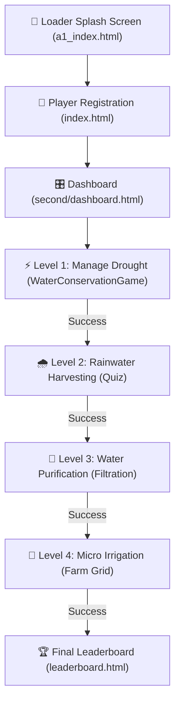

# 💧 Save the Groundwater Game

**Save the Groundwater** is a stunning, gamified educational learning platform designed to teach water conservation, contaminated water purification, and high-efficiency micro-irrigation management. 

Through highly interactive gameplay, players learn the critical importance of preserving village groundwater reserves, sequencing multi-stage filter mediums, and selecting optimal watering methods to sustain crops without depleting natural water sources.

---

## 🎮 Game Progression Flow

---

## ✨ Key Features

*   🛡️ **Forced Initial Registration**: New players are guided to register their player profile name before accessing any game levels.
*   🔒 **Strict Sequential Progression**: Levels unlock one-by-one upon successful completion. Players cannot skip ahead, making the educational journey structured and impactful.
*   💾 **Persistent Local Storage**: Progress, level unlocks, and high scores are tracked and saved per player profile on their browser using `localStorage`.
*   🏠 **Seamless Home Navigation**: Quick Home shortcuts bypass the registration screen once a player profile is saved.
*   🎨 **Premium Glassmorphic UI**: Tailored color palettes, sleek micro-animations, drop shadows, and responsive designs that look beautiful on all viewports.
*   🚜 **One-Row Responsive Dashboard**: Displays all game levels in a clean horizontally scrollable row, ensuring visual consistency across mobile and desktop.

---

## 🕹️ Deep Level Breakdown

| Level | Name | Gameplay & Mechanics | Learning Objective |
| :---: | :--- | :--- | :--- |
| **0** | **Player Setup** | Enter name to register. Bypasses on returning sessions; resets via "Change Name". | Session persistence & profile personalization. |
| **1** | **Manage Drought** | Guide Cheru on a 6000m trek to fetch water. Jump (`↑`) over obstacles and slide (`↓`) under birds to prevent water leakage. | Understand the daily physical struggle of water fetching in rural regions. |
| **2** | **Rainwater Harvesting** | Multiple-choice quiz covering drought management, rainfall storage, and groundwater preservation. | Evaluate theoretical knowledge on water harvesting and conservation. |
| **3** | **Water Purification** | Place filtration media in the correct order: Sand & Gravel (Physical) ➔ Activated Carbon (Chemical) ➔ Chlorine (Biological). | Learn how multi-stage filtering purifies physical, chemical, and biological impurities. |
| **4** | **Micro Irrigation** | Manage a 3x3 crop grid (Lettuce, Tomato, Corn). Use Drip, Sprinkler, or Flood irrigation to fully hydrate crops using under 500L of reserve. | Evaluate efficiency and water wastage factors of different agricultural methods. |

---

## 🛠️ Technology Stack

*   **Core Logic**: Vanilla JavaScript (ES6) for game engines, grid calculators, and local storage state machines.
*   **Structure**: Semantic HTML5 for SEO, page hierarchy, and accessibility.
*   **Styling**: Vanilla CSS3 with root layout tokens, flexbox/grid alignments, aspect-ratio bounds, glassmorphism filters, and smooth CSS keyframe animations.
*   **Data Persistence**: Browser Client `localStorage` API.

---

## 🚀 How to Run Locally

Because the project is built on vanilla web standards, it has **zero external build tool dependencies** and requires no compilation.

### Method A: Direct Double-Click (Quickest)
1. Navigate to the root directory in your file explorer.
2. Double-click the entry file: **`a1_index.html`**.
3. It will launch directly in your default web browser.

### Method B: Live Server (Recommended)
If you are developing or editing files:
1. Open the project folder in **Visual Studio Code**.
2. Install the **Live Server** extension (by Ritwick Dey).
3. Click **"Go Live"** in the status bar at the bottom right.
4. The server runs at `http://127.0.0.1:5500` with auto-reload enabled.

---

## 📝 License
This project is licensed under the **MIT License** - see the [LICENSE](LICENSE) file for details.

---

*Developed with 💙 to raise global awareness of sustainable groundwater conservation.*
